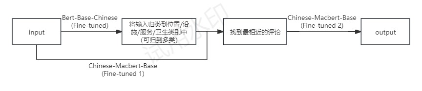
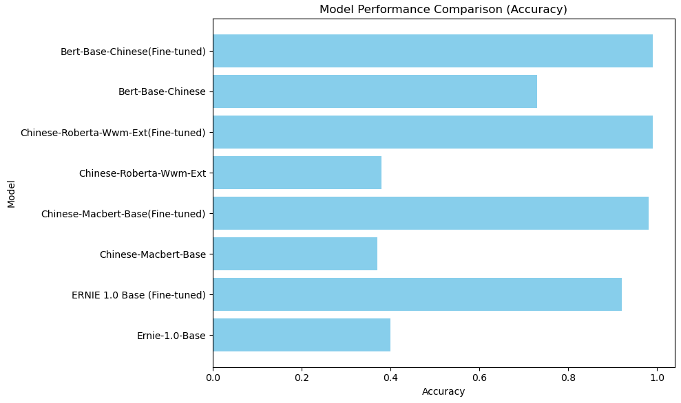

# 项目报告：基于微调BERT和MacBERT模型的多维酒店推荐系统
杜一凡2021200066

## 1. 项目背景与目标
### 1.1 背景
随着旅游行业的发展，用户对酒店的需求愈加个性化和多样化。本项目旨在构建一个智能酒店推荐系统，结合用户输入的需求，基于深度学习模型对酒店信息进行分类、匹配、情感分析，从而筛选出最符合用户偏好的酒店。系统实现快速、精准的推荐，提升用户的决策效率。

### 1.2 目标
- **精准分类**：对酒店评论进行分类，识别出用户关注的主要维度（位置/设施/服务/卫生等四个方面）。
- **语义匹配**：通过语义理解技术，将用户需求与评论进行匹配。
- **情感分析**：评估评论的正负面情感，提供更直观的决策参考。
- **系统集成**：实现一个高效的推荐系统原型，并初步实现可视化功能。

---

## 2. 数据与预处理
### 2.1 数据来源
数据来源于携程网公开的酒店评论，包括：
- **评论文本**：用户对酒店各方面的评价。
- **标签信息**：如评分、酒店名称、地址等结构化数据。

### 2.2 数据预处理
1. **去重与清洗**：去除重复评论和无效字符。
2. **分词与停用词处理**：使用 **jieba** 分词工具进行中文分词，并去除停用词。
3. **文本向量化**：采用预训练语言模型 **Chinese-Macbert-Base** 生成文本嵌入向量。

### 2.3 清洗后数据主要信息
- **评价数量**：36000+条。
- **酒店数量**：涉及2813家酒店。
- **涉及城市**：北京、上海、广州。

---

## 3. 技术方案与模型设计
总体而言，在输入问题后，我们首先通过微调后的bert-base-chinese模型对其进行归类，将问题划到位置/设施/服务/卫生四类中的某些类下，之后利用提前存储的comment_embeddings（有多个，根据分类情况决定使用哪一个）和微调后的chinese-macbert-base模型查找与输入问题最为相似的评论，最后利用另一微调后的chinese-macbert-base模型对其进行情感判断，若为正向评价，则输出其相关酒店信息及该评论，且推荐数量不超过5个。

**图 1: 流程示意图**



### 3.1 分类模型
首先，我们尝试用未经微调的ernie-1.0-base-zh，chinese-macbert-base，chinese-roberta-wwm-ext，bert-base-chinese进行实验，初步测试表明，这些模型在未微调的情况下分类效果不理想，准确率和 F1 分数均较低（具体实验结果见下表 1）。为了提升模型性能，我们标注了北京市800余家酒店评论（累计16000余条）形成了训练集，并通过其对以上模型进行了微调（详细数据见下表1），从实验结果来看，微调后的 bert-base-chinese 在分类任务上表现出了更好的泛用性，因而在分类阶段，我们选用微调过的bert-base-chinese作为主模型。

特别说明的是，标注数据集分为位置、设施、服务和卫生四个类别，为确保模型性能，我们采用 8:2 的比例划分训练集和验证集，训练中使用交叉熵损失函数。实验中，bert-base-chinese 的优异之处体现在其对不同类别评论的分类性能较为均衡，能够为后续评论筛选任务提供可靠支持。

**表 1: 不同模型在分类任务上的表现**

| Model                          | Accuracy | F1-Score (Macro Avg) | F1-Score (Weighted Avg) |
|--------------------------------|----------|----------------------|-------------------------|
| Ernie-1.0-Base                 | 0.40     | 0.14                 | 0.24                    |
| ERNIE 1.0 Base (Fine-tuned)    | 0.92     | 0.85                 | 0.92                    |
| Chinese-Macbert-Base           | 0.37     | 0.19                 | 0.28                    |
| Chinese-Macbert-Base (Fine-tuned) | 0.98     | 0.96                 | 0.98                    |
| Chinese-Roberta-Wwm-Ext        | 0.38     | 0.16                 | 0.26                    |
| Chinese-Roberta-Wwm-Ext (Fine-tuned) | 0.99     | 0.97                 | 0.99                    |
| Bert-Base-Chinese              | 0.73     | 0.69                 | 0.63                    |
| Bert-Base-Chinese (Fine-tuned) | 0.99     | 0.97                 | 0.99                    |

**图 2: 不同模型在分类任务上的表现**




### 3.2 语义匹配模型
类似地，我们首先尝试用未经微调的ernie-1.0-base-zh，chinese-macbert-base，chinese-roberta-wwm-ext，bert-base-chinese和paraphrase-multilingual-MiniLM-L12-v2进行实验，基于向量相似度（余弦相似度）计算用户需求与评论之间的匹配度。

初步测试表明，这些模型在未微调的情况下效果较差，正确率普遍在10%以下。为了提升模型性能，我们再次使用分类模型中的训练集对以上模型进行了微调（详细数据见下表2），从实验结果来看，微调后的 chinese-macbert-base 在查找相似评论方面较其他模型有显著优势，因而在语义匹配阶段，我们选用微调过的chinese-macbert-base作为主模型。

**表 2: 不同模型在语义匹配任务上的表现**

| Model                                   | Accuracy |
|-----------------------------------------|----------|
| ERNIE-1.0-Base (Fine-tuned)             | 0.20     |
| Chinese-Macbert-Base (Fine-tuned)       | 0.77     |
| Chinese-Roberta-Wwm-Ext (Fine-tuned)    | 0.45     |
| Bert-Base-Chinese (Fine-tuned)          | 0.28     |
| Paraphrase-Multilingual-MiniLM-L12-v2   | 0.62     |

此外，为了提高计算效率，我们注意到生成句子嵌入（comment_embeddings）的过程耗时较长，且结果是固定的。因此，我们提前处理并将嵌入结果保存在本地，后续直接读取即可。结合微调后的 chinese-macbert-base 模型，这一方法有效避免了重复计算，大幅提升了查找相似评论的效率。

示例代码：
```python
import pickle
comments = combined_df["reviews"].tolist()
model = AutoModelForMaskedLM.from_pretrained('D://mac_1213')
tokenizer = AutoTokenizer.from_pretrained('D://mac_1213')

def get_embeddings(sentences, tokenizer, model):
    inputs = tokenizer(sentences, padding=True, truncation=True, return_tensors="pt")
    with torch.no_grad():
        outputs = model(**inputs)
        embeddings = outputs.last_hidden_state.mean(dim=1)
    return embeddings

comment_embeddings = get_embeddings(comments, tokenizer, model)
with open("D://comment_embeddings_macbert.pkl", "wb") as f:
    pickle.dump(comment_embeddings, f)
```

### 3.3 情感分析模型
此处，我们仍然首先尝试用未经微调的ernie-1.0-base-zh，chinese-macbert-base，chinese-roberta-wwm-ext，bert-base-chinese进行实验，结果同上文类似，表现均不理想。为了提升模型性能，我们标注了北京市酒店评论中的2000条作为训练集，并通过其对以上模型进行了微调（详细数据见下表3），从实验结果来看，微调后的 chinese-macbert-base 在判断情感任务中表现出微弱优势。因此，在该阶段，我们选用微调过的chinese-macbert-base作为主模型。

**表 3: 不同模型在情感分析任务上的表现**

| Model                              | Accuracy | F1-Score (Macro Avg) | F1-Score (Weighted Avg) |
|------------------------------------|----------|-----------------------|--------------------------|
| ERNIE-1.0-Base (Fine-tuned)        | 0.69     | 0.65                  | 0.70                     |
| Chinese-Macbert-Base (Fine-tuned)  | 0.94     | 0.93                  | 0.94                     |
| Chinese-Roberta-Wwm-Ext (Fine-tuned)| 0.94    | 0.93                  | 0.94                     |
| Bert-Base-Chinese (Fine-tuned)     | 0.93     | 0.92                  | 0.93                     |

### 3.4 数据整合与输出模块
将匹配到的评论与酒店信息动态结合，并通过图文并茂的形式在前端呈现。

**图 3: 前端示意图**


---

## 4. 实验与结果
### 4.1 实验设置
- **测试数据**：40条测试语句，包含位置/设施/服务/卫生等四类，且部分测试语句涵盖两种类型。
- **评估指标**：准确率，通过人工判断。
- **评估结果**：准确率**74%**。

### 4.2 推荐效果示例
| 用户需求        | 推荐评论                                        |
|-----------------|-----------------------------------------------|
| "我想找一个没什么味道的酒店"        | "酒店非常好，每次过来都住这家，环境很好，没有异味。"       |
| "我希望找一个工作人员态度比较好的酒店"      | "房间干净整洁有序，服务人员很信心，非常满意。"           |
| "我希望找一个能够按时做房间清洁的酒店"      | "卫生清洁方面也好，每天按时清洁。"         |

---

## 5. 结论与未来展望
### 5.1 结论
本项目通过结合 **Bert-Base-Chinese** 和 **Chinese-Macbert-Base**模型，实现了一个高效的酒店评论推荐系统，主要优势包括：
- **高精度匹配：** 准确的评论分类与情感分析，准确率稳定在 **70%** 以上。
- **多模型协作：** 需求分类、评论匹配和情感分析模块协同工作，实现高效智能推荐。
- **预处理优化：** 通过嵌入向量的离线存储，大幅提升运行效率。
- **地域划分：** 当输入问题指定城市时，程序仅返回该城市的推荐酒店。

### 5.2 未来工作
- 引入大语言模型 ChatGLM，进一步提升语义理解能力。
- 优化实时评论增量更新机制，提升系统适应性。
- 跨领域扩展，支持多语言酒店评论推荐。
- 增加用户偏好学习，通过记录用户历史行为优化推荐。
- 融入更多条件筛选，如价格、房型、入住时间等。
- 提升前端交互体验，优化界面布局和响应速度。

---

## 附录：代码
### 代码链接
[GitHub 仓库地址](https://github.com/Gustav1937/nlp24projects)

---
