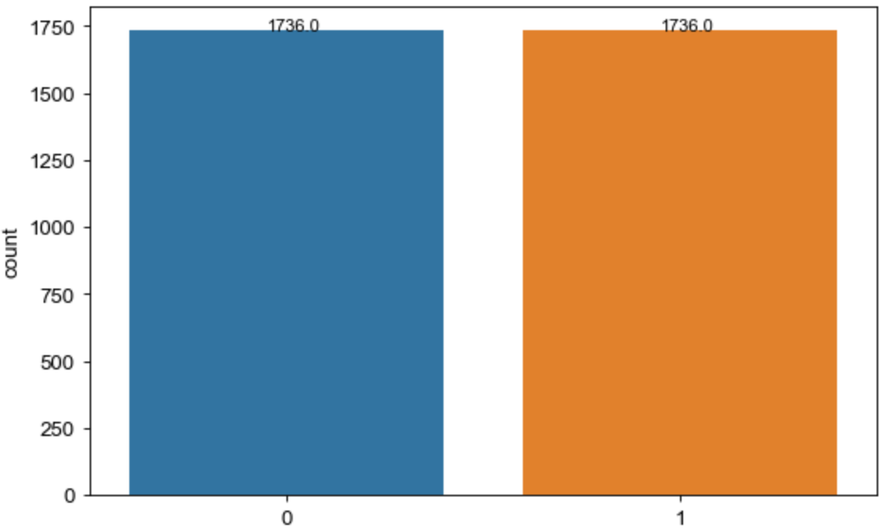

# 自然语言处理：课程作业报告 - 2021200142


## 问题背景
### “清汤大老爷”模拟器——基于BERT的订单评价检验

**外卖评论情感分析**

当前店铺评分、外卖评分是对餐饮商户重要的评价手段。通过自然语言分析，对订单评价及其评分做初步检验，对外卖评论进行基础情感分析。

**外卖评论讽刺分析**

目前存在较多的顾客恶意评论或是商家刷单行为，使商户餐饮质量和其得分存在一定的偏差；通过讽刺分析，检验其中的异常评论，提高评论审核效率。

## 数据准备
### 情感分析数据集
数据来源：[huggingface-waimai_10k](https://huggingface.co/datasets/XiangPan/waimai_10k/blob/main/waimai_10k.csv)[./src/waimai.csv]
- 中文外卖评论数据集；
- 总共包含11,987条数据，切分训练集9,000条，测试集2,987条；
- 配有文本情感标签：1-正向情绪、0-负向情绪

### 讽刺分析数据集
1. 单语句讽刺数据集[./src/Chinese-S/data/]
- 训练集：2119个样本(正例: 383, 负例: 1736)
- 测试集：903个样本(正例: 163, 负例: 740)；
- 配有讽刺标签：1-讽刺、0-非讽刺

2. 上下文语境（带主题）讽刺数据集[./src/12-Topic/data/]
- 总共包含4,871条数据，其中训练集2,925条，测试集973条，开发集973条；
- 配有讽刺标签：1-讽刺、0-非讽刺

## 环境搭建
本项目所需要的库包及其相应版本已封装于environment.yml文件中，可通过如下代码建立一个可运行的环境：
```bash
conda env create -f environment.yml
```

## ★ 模型训练与验证 [./src/Stage.ipynb](./src/Stage.ipynb)

本次项目根据验收周期分为3个Stage递进完成。分别为**基础情感分析**、**单语句讽刺分析**、**上下文语境参考讽刺分析**。如下对三个Stage分别展开说明。

### 基础情感分析
使用Hugging Face的transformers库，加载预训练的BERT中文基础模型（bert-base-chinese），并进行文本情感分类分析的预测。
```python
def tokenize_function(examples):
    return tokenizer(examples["text"], padding="max_length", truncation=True)

def compute_metrics(eval_pred):
    logits, labels = eval_pred
    predictions = np.argmax(logits, axis=-1)
    return {"accuracy": accuracy_score(labels, predictions)}

def predict(text, model, tokenizer):
    inputs = tokenizer(text, return_tensors="pt")

    with torch.no_grad():
        outputs = model(**inputs)
        logits = outputs.logits
        predicted_class = torch.argmax(logits).item()

    return int(predicted_class)
tokenizer = AutoTokenizer.from_pretrained("google-bert/bert-base-chinese")
```
对文本数据使用tokenizer进行分词处理，并利用模型进行标签预测，返回情绪分析类别标签。

此处使用BERT模型，可对长文本的上下文语境信息进行处理；并采用预训练的中文基础模型，在当前有监督数据上可更高效地进行情绪分析。

最终该模型准确率可达89.09%。

### 单语句讽刺分析

针对评论语句情感与其评分相背离的样本，考虑可能存在讽刺的情况（例如给出差评，并在评论中“阴阳怪气”商家）。如下基于单个语句进行讽刺分析，其目的是**尽可能筛选出可能存在讽刺的样本（即尽可能提高召回率）**，为提供给人工识别的样本进行初筛。

#### 多特征讽刺识别
根据两篇基于单语句讽刺检测的论文，它们给出了一系列针对讽刺识别的特征，例如**情感极性**，**基于句法、基于模式的特征向量**。本点针对这两种方案尝试复现，用于新数据集的讽刺分析。

1. **情感极性分析**：
    
    **参考文献**：Recognition of Sarcasm in Tweets Based on Concept Level Sentiment Analysis and Supervised Learning Approaches(Piyoros Tungthamthiti, 2014)；

    - 原文献中基于英文语料，采用SentiStrength和SenticNet词典进行词汇的情感分析；
    
    - 在中文语料情境下，尝试使用**中文语料模型/词典**辅助分析。（SnowNLP模型主要对语段、句子做情感分析，对独立词汇的分析效果较差；此处利用**中文情感分析库CnSenti**辅助进行情感极性分析）

    **主要原理**：考量句子中的情绪词汇，若同时出现正面/负面情感词汇，且比例较大，考虑可能是讽刺语句。

    **模型效果**：模型对讽刺语句具有74.19%的预测准确率，但正例召回率偏低。

2. **基于句法、基于模式的特征向量**：

    **参考文献**：Enhanced Sentiment Learning Using Twitter Hashtags and Smileys(Dmitry Davidov, Oren Tsur, 2010)；

    - 原论文“基于模式”的方法针对英语效果较好，而中文效果较差；此处仅基于句法制造特征向量。

    **主要原理**：考量句子中出现的标点符号，例如感叹号（！）、破折号（——）、问号（？）等，检测其出现频率对讽刺预测的作用。

    **模型效果**：模型对讽刺语句具有79.25%的预测准确率，同样正例召回率偏低。

**总结**：利用语句自身特征进行讽刺识别，由于其条件苛刻、且中英文讽刺模式有所区别，可能无法准确地找出所有的讽刺语句，导致召回率偏低。

#### 利用讽刺分析数据集训练深度学习网络——基于BERT向量

在【基础情感分析】模块的分词、预测方法基础上，以BERT模型提取的文本嵌入表示（即embedding向量）为特征，连接深度学习网络对特征进一步提取和加工，辅助分类决策。

```python
# 文本嵌入表示函数
def encode_text(texts):
    inputs = tokenizer(texts, padding=True, truncation=True, return_tensors="pt")
    with torch.no_grad():
        outputs = model(**inputs)
    # 使用最后一层的hidden states的平均值作为句子的表示
    embeddings = outputs.last_hidden_state[:, 0, :].numpy()
    return embeddings

……

# 接入深度学习网络训练
x_in = Input(shape=(768,))
x_out = Dense(32, activation="relu")(x_in)
x_out = BatchNormalization()(x_out)
x_out = Dense(num_classes, activation="softmax")(x_out)
model = Model(inputs=x_in, outputs=x_out)
print(model.summary())

model.compile(loss='categorical_crossentropy',
              optimizer=Adam(),
              metrics=['accuracy'])
```

利用BERT+深度学习网络的准确率可提升至85.16%，且正例召回率显著提高；

|  | Precision  |  Recall  |  F1-Score  | Support |
| :---: | :--: | :--: | :--: | :---: |
|  0  | 0.92 | 0.89 | 0.91 | 740 |
|  1  | 0.58 | 0.66 | 0.62 | 163 |

但由于讽刺识别的主要目的为尽可能多的找到讽刺语句，即需要较高的**正例查全率**，因此该模型仍有提高的空间。

观察发现数据集中**正例样本比例较低**，因此采取**SMOTE平衡**方法，尝试提高**正例查全率**。

##### SMOTE平衡

**SMOTE**（Synthetic Minority Over-sampling Technique）：用于处理不平衡数据集，通过生成合成样本来增加少数类样本的数量，从而平衡类别分布。

此处对训练集样本进行SMOTE平衡。需要注意的是，**不能对测试集进行平衡**，以免影响测试准确性。

```python
# 使用imlbearn库中上采样方法中的SMOTE接口
from imblearn.over_sampling import SMOTE
# 定义SMOTE模型
x_train = np.array(train_embeddings)
x_test = np.array(test_embeddings)
y_train = np.array(s_train_df['label'].values)
y_test = np.array(s_test_df['label'].values)
smo = SMOTE(random_state=42)
```

重新检查（训练集）样本平衡性，如下图所示。



在平衡样本下重新使用**BERT+深度学习网络**训练模型，并在测试集上观察模型效果。

|  | Precision  |  Recall  |  F1-Score  | Support |
| :---: | :--: | :--: | :--: | :---: |
|  0  | 0.94 | 0.83 | 0.91 | 740 |
|  1  | 0.50 | 0.75 | 0.62 | 163 |

虽然准确率降低至81.84%，但正例查全率由66%提升至75%，该模型能寻找到更多的讽刺语句，更适应此处的项目需求。

针对部分讽刺样本以及实际外卖评论样本进行测试，测试效果如下：

```
文本：'真山真水拍成假山假水，这导演太厉害了。' 预测类别：讽刺
文本：'这位李先生笑死我了。' 预测类别：非讽刺
文本：'菜品丰富，每道菜都非常美味可口。' 预测类别：非讽刺
文本：'真的太厉害了！能让大家吃的都不满意！' 预测类别：讽刺
文本：'这个粉我知道，上次我们村闹洪灾就是这个粉把水吸完的！' 预测类别：非讽刺
```

大部分文本都能准确判断出是否讽刺，但涉及一定语境的句子（例如上面的第五段文本），模型难以识别。因此进一步添加**话题语境联合识别**，以更准确地查询到讽刺样本。

#### 利用模型找出原数据集的讽刺评论

当emotion标签和情感分析结果不同时，判断是否由于讽刺而造成不同。

原数据共有875条样本出现emotion标签和情感分析结果不同的情况，而经过讽刺模型检验，其中属于讽刺样本的有246条。

详细观察发现“属于讽刺样本”的评论中，其中一部分是“夸赞外卖小哥，但菜品质量较差”或相反的情况。

例如：*“感觉没有在店里的好吃，感谢送餐师傅我们家六楼没电梯还得爬楼梯。”*

因此讽刺分析不仅需要判断“阴阳怪气”的评论，有时还需要找出“差评归因有别”的评论。

### 订单语境+上下文分析

结合上下文，面向话题对评论进行讽刺识别。在外卖评论中，限制相关主题，尝试对具有特定语境的讽刺语句进行识别。

**参考文献**：Topic-Oriented Sarcasm Detection: New Task, New Dataset and New Method(Bin Liang, Zijie Lin, Bing Qin, Ruifeng Xu, 2022)

将带语境主体的讽刺语句样本转换成PyTorch的DataLoader对象，以便在训练过程中批量加载和处理数据。并通过一个学习率调度器，在训练过程中调整学习率，以优化模型的训练效果。

本点利用PyTorch框架来加载预训练的BERT模型，**进一步尝试对BERT模型进行微调，适应当前的语境主题讽刺分类下游任务**。运行效果如下所示：

```
1. “这个粉我知道，上次我们村闹洪灾就是这个粉把水吸完的！”【是】对“顾客在外卖平台上购买商品。”【的讽刺】
2. “菜做的不好吃”【不是】对“顾客在外卖平台上购买商品。”【的讽刺】
```
本方法能够对相应的上下文文本做出讽刺检验，对上述讽刺检验做了良好的补充。


## 模型保存
为方便此后模型调整、使用，将上述各模型（参数）均另存至项目中，再次使用时无需重新训练。

1.情感分析——BERT向量（./src/bert_emb.csv）

2.讽刺分析——BERT+深度学习模型（数据平衡前：./visit_classify.h5、数据平衡后：./src/balance_visit_classify.h5）

3.上下文语境讽刺分析——微调BERT（./src/12-topic/save/bert/best_model.std）

使用时可直接调用相应的模型，例如：
```python
model = load_model('balance_visit_classify.h5')
```
（Tip：受限于上传文件大小，此处未随项目上传已加载的模型，可通过运行./src/Stage.ipynb重新在相应位置加载出上述模型。）

## 结果与展望
本项目通过构建基于BERT的模型，实现了对外卖评论的情感分析和讽刺检测。同时，对模型的保存和复用为后续的调整和应用提供了相应的便利。

1. 针对评论基础情感分析，加载预训练的BERT中文基础模型（bert-base-chinese），进行文本情感分类分析的预测。
2. 针对单语句的讽刺分析，采用了特征工程和深度学习网络。同时通过SMOTE平衡技术处理数据不平衡问题，提高了讽刺检测的正例查全率。
3. 针对上下文语境的讽刺分析，进一步尝试对BERT模型进行微调，适应当前任务，能够对此前的单语句讽刺分析形成良好的补充。

该模型受限于中文评论样本数据的稀缺，对外卖语境的情感/讽刺分析准确度难以进一步提高（例如部分评论样本表述过短、逻辑不清等问题）。

后续若应用至实际场景，结合外卖平台的实际评论数据库，可以进一步优化模型，提高讽刺检测的准确性，特别在理解语境和复杂讽刺表达方面，有进一步的提升空间。
