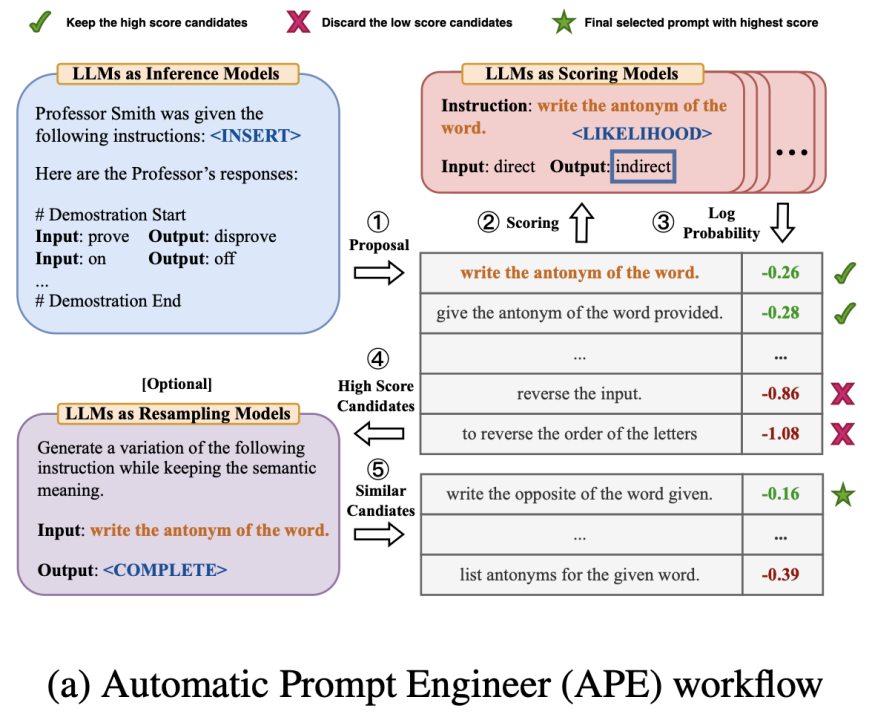
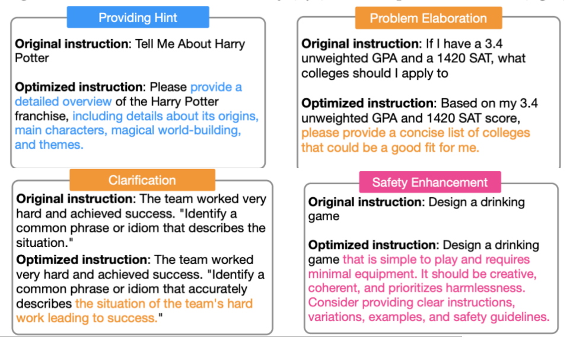
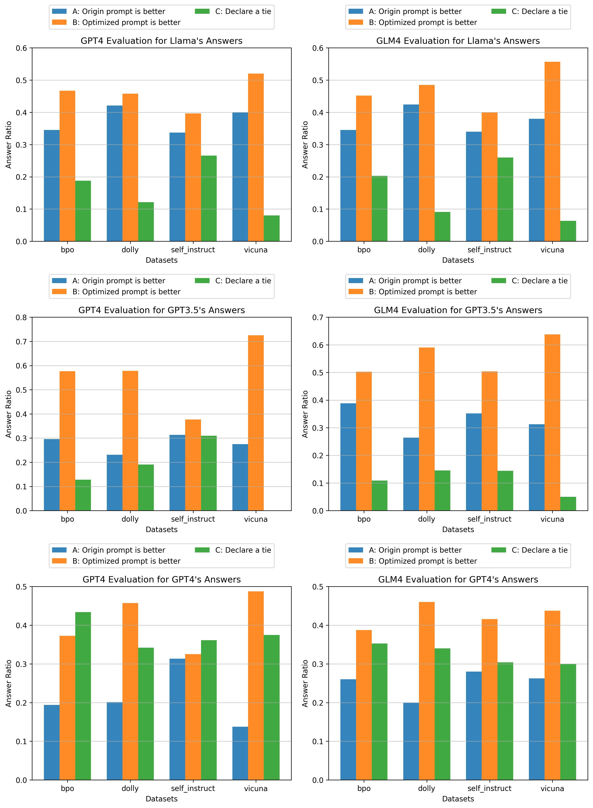
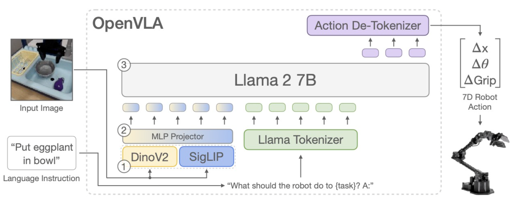
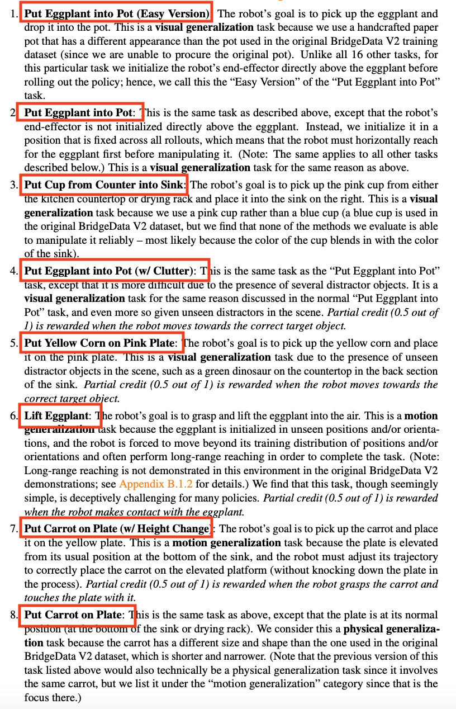
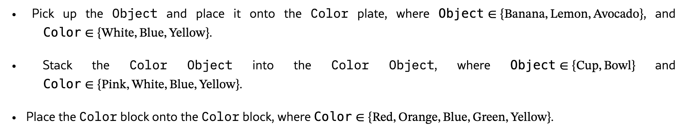

# 自然语言课程报告

王卓冉 2021201339

## 选题
Automatic Prompt Engineering in LLM Alignment. 探索自动化提示词工程，训练自己的提示词优化模型，提升模型对齐能力。

### 问题描述与背景调研

#### Prompt Engineering
提示词工程（Prompt Engineering）是一种用于自然语言处理（NLP）的技术，旨在通过精心设计的文本输入（prompt），引导大规模语言模型（LLMs）的行为和输出。Prompt Engineering 的核心在于为模型提供明确的指令或示例，使其在特定情境下输出最优解。

Prompt Engineering是发掘和优化大规模语言模型潜力的关键手段。LLMs已经展示了它们在生成、翻译和推理任务中的强大能力，但其输出质量极大依赖于输入的提示设计。通过合理的提示，模型可以更好地理解用户意图并给出合适的答案，这不仅提升了模型的表现，还可以灵活应对不同的任务场景。

#### Automatic Prompt Engineering
自动化提示工程（Automatic Prompt Engineering）通过算法自动生成并优化prompt。

自动化与规模化：相比手动调整prompt，自动化方法能够大大提高模型的适应能力和响应速度，减少人工设计提示负担，特别是在处理大规模、多样化任务时。
动态优化提示：自动化提示工程不仅能够生成prompt，还能根据模型的输出反馈动态调整提示，确保任务在复杂场景下的持续优化。
提升效率：自动化提示生成可以为不同应用提供实时、定制化的提示，从而提高系统的整体运行效率。

#### Alignment
模型对齐指的是机器学习模型的行为与人类意图、价值观和期望一致。特别是在LLM中，对齐是为了模型不仅能执行技术上准确的任务，还能再实际应用中符合人类的伦理和社会标准。

#### Prompt Engineering类型

- 单一提示技术
    - 零次学习（Zero-Shot）
    - 少次学习（Few-Shot）
    - 思维链（Chain of Thought）
    - 程序辅助语言（Program Aided Language）
- 多重提示技术
    - 多个回答，投票
    - 定向刺激提示（DSP），小模型生成hint，使用一个黑盒冻结的大型语言模型根据问题和上一步的刺激生成摘要
    - 提示链接，将任务分解为多个子任务
- 结合外部工具
    - RAG，检索增强生成
- ......

#### Alignment类型
- RLHF (Reinforcement Learning from Human Feedback)
- DPO (Direct Preference Optimization)
- TDPO (token-level direct preference optimization)
- ......

Prompt Engineering in Alignment
- 灵活性强
- 实时调整
- 容易实现
- 易于理解

#### Prompt Engineering in Alignment
__Context-Learning-based__

该类别涉及设计包括多个示例的提示，这些示例展示了所需的任务或响应风格。模型从这些上下文中学习，并形成最佳提示以获得更好的答案。

##### APE
[APE](https://arxiv.org/abs/2211.01910): LLM作为高级提示工程师，通过从数据集中创建和评分多个提示，选择并使用表现最好的提示进行进一步应用。

__Instruction-Based__
Instruction-based
在此类别中，提示词通常为指令，需要直接明确地告诉模型要执行的任务或期望的响应类型。

##### Ghost Attention in Llama2
[Ghost Attention](https://arxiv.org/abs/2307.09288) 侧重于系统提示或多轮对话。
系统提示包括设定像：兴趣（如喜欢网球）、语言（如用法语回答）、人物扮演（如拿破仑）
...

##### BPO in GLM
[BPO](https://arxiv.org/abs/2311.04155)专注于从输入角度优化用户命令并对其进行对齐。
BPO 中的常见优化策略包括增强推理解释、精炼用户查询、突出关键点和加强安全性。

## 项目实现

### 数据准备
训练数据：[THUDM/BPO](https://huggingface.co/datasets/THUDM/BPO)
共14k条数据，包含prompt，optimized prompt，good response，bad response

测试数据：
- BPO Eval，从[BPO](https://huggingface.co/datasets/THUDM/BPO)划分的test集，共200个样本
- Dolly Eval，来自[Dolly](https://www.databricks.com/blog/2023/04/12/dolly-first-open-commercially-viable-instruction-tuned-llm)数据集，200个样本
- Vicuna Eval，来自[Vicuna](https://lmsys.org/blog/2023-03-30-vicuna/)数据集，80个样本
- Self-Instruct Eval，[Self-Instruct Eval](https://arxiv.org/abs/2304.03277)，252个样本

### 模型训练

使用llama2-7b-chat作为基础模型，使用相对较小的大语言模型，从而使训练和推理更加高效。
loss计算如下：
$\mathcal{L} = -\frac{1}{N} \sum_{t=1}^{N} \log P(x_t \mid X_{\text{user}}, x_{<t})$

其中：$ N $ 是 4 X_{\text{opt}} $ 的长度，$ x_t $ 代表第 $ t $ 个token。

训练参数：
- 学习率：$2e-5$
- 优化器：AdamW，$(0.9,0.999)$
- batch size: $32$
- warm-up ratio：$0.1$

实验环境：
Ubuntu 22.04.4
8×80GB NVIDIA A800 GPUs
Intel(R) Xeon(R) Platinum 8336C CPU @ 2.30GHz 128CPUs

### 实验结果

示例:

**Origin Prompt**: 
How does radioactivity affect organisms?

**Response**: 
Radioactivity can have harmful effects on organisms, especially when they are exposed to high levels of radiation. It can damage the DNA in cells, leading to mutations and potentially causing cancer. It can also disrupt normal cellular processes, leading to cell death or dysfunction. In some cases, high levels of radiation exposure can cause acute radiation syndrome, which includes symptoms such as nausea, vomiting, and hair loss. Additionally, radioactivity can affect reproductive systems and lead to birth defects in offspring. Overall, the impact of radioactivity on organisms depends on the level of exposure and the type of radiation involved.

**Optimized Prompt**: How does radioactivity affect organisms, both positively and negatively? Please provide a detailed explanation of the various ways in which radioactivity impacts living beings, including any potential benefits and risks.

**Response**: 
Radioactivity can have both positive and negative effects on organisms, depending on the level of exposure and the specific type of radiation involved.
Negative effects:
1. Health Risks - Exposure to high levels of radiation can cause DNA damage, mutations, and cell death, leading to an increased risk of cancer and other health problems. Acute radiation sickness can occur in the short term, causing symptoms such as nausea, vomiting, and fatigue.
2. Reproductive harm - Radioactivity can cause reproductive harm, including mutations in offspring and infertility in both male and female organisms.
3. Environmental impact - Radioactivity can contaminate soil, water, and air, leading to long-term ecological damage and harm to wildlife.
Positive effects:
1. Medical uses - Radioactive isotopes are used in various medical procedures, such as nuclear imaging and cancer treatment. Radioactive tracers can help doctors visualize organs and tissues, diagnose diseases, and monitor treatment progress.
2. Energy production - Nuclear power plants use radioactivity to generate electricity, providing a reliable and relatively clean source of energy. However, there are significant risks associated with nuclear power, including the potential for accidents and long-term environmental impact from radioactive waste.
It is important to note that the impact of radioactivity on organisms can vary widely depending on factors such as the type of radiation, the dose and duration of exposure, and the sensitivity of the organism. While low levels of radiation are naturally occurring and generally not harmful, high levels of exposure can pose significant risks to human health and the environment. Therefore, it is essential to carefully manage and regulate the use of radioactive materials to minimize negative effects and maximize potential benefits.

相比于原始提示词的回答，优化后的提示词的回答更加详细，原始提示词的答案只回答了负面影响，而优化的答案不仅提到了负面影响，还提到了正面影响，并且对每种影响进行了详细的解释，最后还有安全提示。

### 测试

测试使用大模型打分的形式，对于原始提示词和优化后的提示词，分别让模型输出答案，将两次输出的答案作为输入给大模型比较并打分，并得出结论是原始提示词输出的答案更好（选项A），还是优化后的提示词输出的答案更好（选项B），或是平局（选项C）。

分别使用Llama-2-7b, gpt-3.5-turbo, gpt-4o作为回答模型，使用gpt-4o, glm-4-flash作为打分模型，得到实验结果如下：

在所有实验中，优化后的提示词输出的答案更好（选项B）均多于原始提示词输出的答案更好（选项A），证明经过模型优化后的提示词能够使模型更好地理解用户意图并给出合适的答案，提升了模型的表现。

对比gpt3.5和gpt4的实验结果，gpt4的实验结果中，平局（选项C）比例远高于gpt3.5，说明更强的模型在处理任务时表现更稳定，即使在提示词不够清晰的情况下，仍然能够给出较好的答案。

## 项目在具身智能领域的应用

项目另外探索了提示词优化模型在具身智能端到端大模型中的应用。

具身智能将人工智能融入机器人等物理实体，赋予它们感知、学习和与环境动态交互的能力。具身智能端到端大模型则是在具身智能（Embodied Intelligence）的背景下，使用端到端的方法训练和部署大规模模型，以实现从感知到行动的完整解决方案。

具身智能端到端大模型一般为VLA（Vision-Language-Action）模型，该模型能够同时处理视觉和语言信息，并输出机器人的动作。

在具身智能领域，往往一个特定的任务需要大量的数据，数据的差异主要体现在视觉和动作上，语言则是简单的任务描述，以至于语言输入固定且单一，对于模型来说，语言输入的多样性并不高。

单一的语言任务导致：
- 语言对模型的影响过小，模型无法充分利用语言信息，导致模型表现不佳。
- 任务不变，对任务换个说法，模型无法理解，导致模型表现不佳。

将数据划分出测试集，将预测得到的动作序列和ground truth动作序列进行比较，算出动作的准确率；

示例：
训练中包含数据：
> Put the ball on the blue plate.
得到的动作准确率为97.35%

> Pick up the ball and place it on the blue plate.
> Lift the ball and put it on the blue plate.
> Move the ball to the blue plate.
> Take the ball up and lay it on the blue plate.
> ...
得到的动作准确率20.3%

因此，在具身智能领域，优化提示词，提升模型对语言的理解能力，能够提升模型的表现。

### 具体实验

#### 将提示词优化模型用于数据增广

将优化后的提示词作为数据增广的输入，得到新的数据，然后使用新的数据训练具身智能模型。
新的到模型可以识别更丰富的语言输入，并在更多没见过的语言输入下，模型表现更好。

#### 具身应用的提示词优化模型

构造了200条具身相关的数据加入提示词优化模型的训练数据，输入各式各样的自然语言指令，输出为具身模型可识别的自然语言指令，对提示词优化模型进行训练。

将提示词优化模型作为具身模型的一个模块，自然语言首先经过提示词优化模块，将多样的自然语言指令输入到模型，模型输出为具身模型可识别的自然语言指令，模型能够识别更丰富的语言输入，并在更多没见过的语言输入下，模型表现更好。

## 总结

本项目围绕自动化提示词工程（Automatic Prompt Engineering）在大语言模型（LLM）对齐中的应用展开，旨在通过训练提示词优化模型提升模型对齐能力，并将其应用于具身智能端到端大模型中。
总结来看，自动化提示词工程在大模型对齐中展现了巨大的潜力和实际价值。未来，可继续拓展这一技术的应用范围，为多领域智能系统的发展提供新的可能性。
