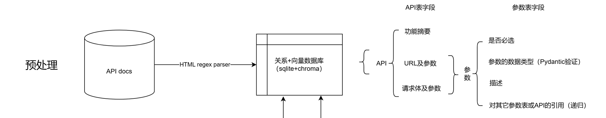
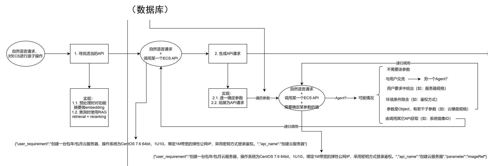
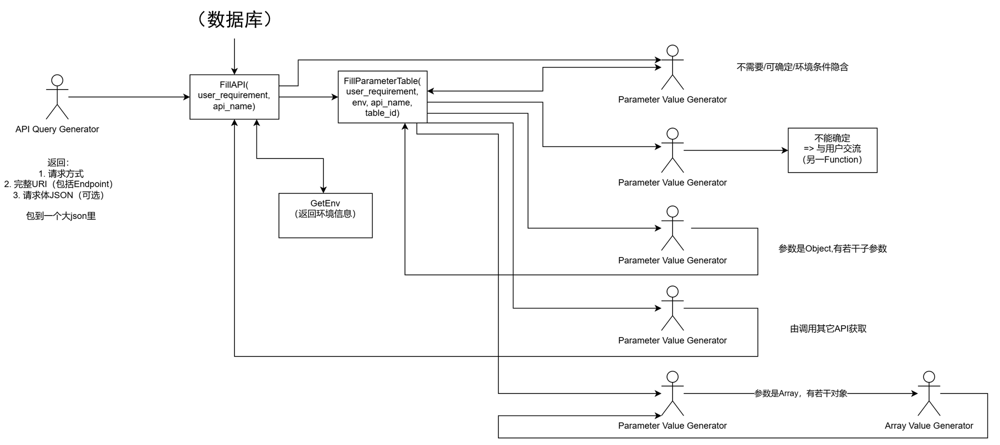
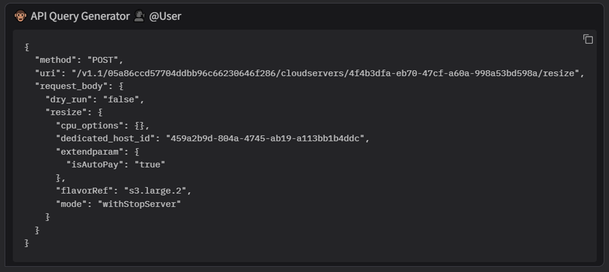
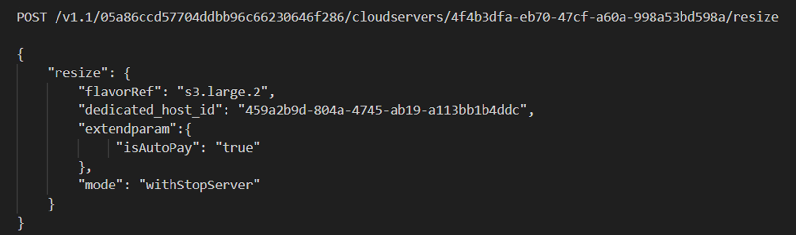
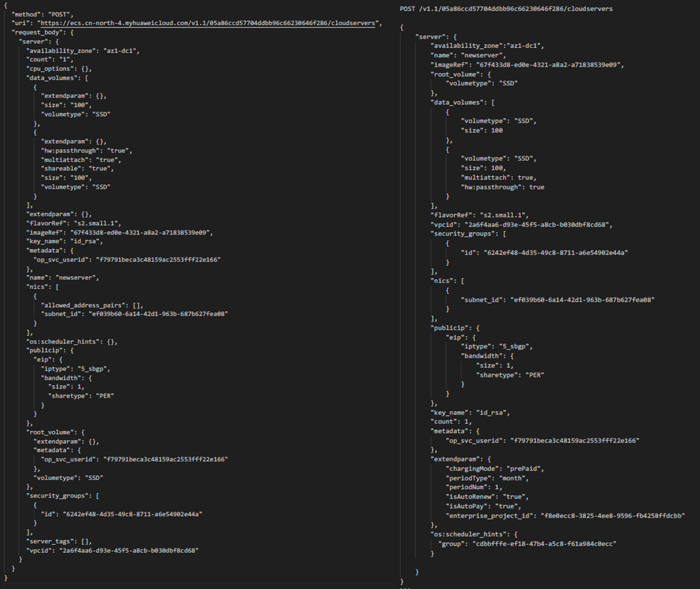

# 基于 Agentic RAG 的 LLM 复杂函数调用

## 一、问题背景

在当今人工智能领域，大语言模型（Large Language Models, LLMs）的应用日益广泛，但其在实际复杂场景中的能力仍有局限。为解决此问题，本项目基于检索增强生成（Retrieval-Augmented Generation, RAG）方法，探索 LLM 在处理现实世界复杂函数调用时的表现。RAG 的核心思想是通过引入检索模块，从大规模外部知识库中获取相关信息，从而提升生成结果的质量与准确性。

本项目选择了华为云 ECS 云服务器的 API 文档作为实验数据集，研究如何优化 LLM 处理以下问题：

1. 面对参数量极大的 API（最多 57 项参数），如何提取并正确生成请求。
2. 用户需求通常以自然语言形式提出，需要高效地从需求中解析出 API 所需的参数值。
3. 复杂 API 调用中可能存在参数嵌套和 API 依赖问题。

---

## 二、研究方法

### 2.1. 基线方法：Naive RAG

Naive RAG 的实现基于以下思路：
- 每个 API 文档描述了一个 API。通过 LLM 生成文档的嵌入向量（embedding），并将其存储在向量数据库中。
- 用户输入自然语言需求后，检索最相似的文档，将其作为上下文输入到 LLM 中，以生成最终的 API 请求。

Baseline 的缺点是，在参数复杂或依赖性较强的 API 请求中，往往难以保证准确性，容易导致参数遗漏或解析错误。

### 2.2. 改进方法：Agentic RAG

Agentic RAG 在 RAG 方法基础上引入了“智能体”概念（Agent），通过高级查询分解和多步推理优化 API 调用过程。

本方法的基本思路是，逐一确定每个**原子**参数的值，最大限度提高 LLM 的响应正确率。具体实现包括以下几个阶段：

#### 2.2.1. 预处理阶段

通过 HTML 解析器提取 API 文档中的相关信息，存储到关系型数据库和向量数据库中。

#### 2.2.2. 查询阶段

该阶段分为两步：
1. 检索最适合的 API 文档。
2. 结合检索结果与自然语言需求，采用递归方法依次确定每个参数的值，最终生成 API 请求。

#### 2.2.3. Agent 化处理

基于 agency-swarm 框架，将2.2.2中描述的算法流程实现为 Agent。针对复杂的参数嵌套和参数列表，设计了对话和递归机制，使得生成结果更为精确。

---

## 三、实验设计与评估

### 3.1. 数据集

实验选用华为云 ECS 云服务器的 API 文档，其中最多的一个 API 含有 57 个可选参数。我们从中选取 10 个最常用的功能 API，并提取相关文档中的请求示例作为测试样例。输入为自然语言需求，输出为对应的 API 请求。

### 3.2. 评价指标

- **调用正确率**：一次 API 调用是否完全正确，即能否成功
- **参数正确率**：单个参数的值是否准确无误

---

## 四、实验结果

实验结果表明，Agentic RAG 方法在复杂场景中优于基线方法：

| 方法  | 调用正确率 | 参数正确率 |
| :---: | :--------: | :--------: |
| 基线  |    90%     |    65%     |
| 改进  |    90%     |    89%     |

### 4.1. 成功率相比 Baseline 提升

在参数数目较少的简单数据（≤10 项参数）上，两种方法均可以实现 100% 的调用正确率，但改进方法相对基线在复杂数据上提升明显。此外，改进方法在复杂参数（多层嵌套和列表）场景中的鲁棒性和可扩展性强，优势更加明显。

#### 示例

改进方法：

正确结果：

### 4.2 改进方法仍存在进一步提高空间

改进方法仍存在失败情况。例如，在极端复杂需求中，参数值存在不一致或遗漏。

#### 示例

左：改进方法，右：正确结果

## 五、总结

本项目实现了基于 Agentic RAG 的 LLM 复杂函数调用，在现实复杂场景中有效提高了函数调用准确率。通过引入智能体和递归对话机制，改进方法提高了可解释性，展示了较强的鲁棒性和可扩展性。
