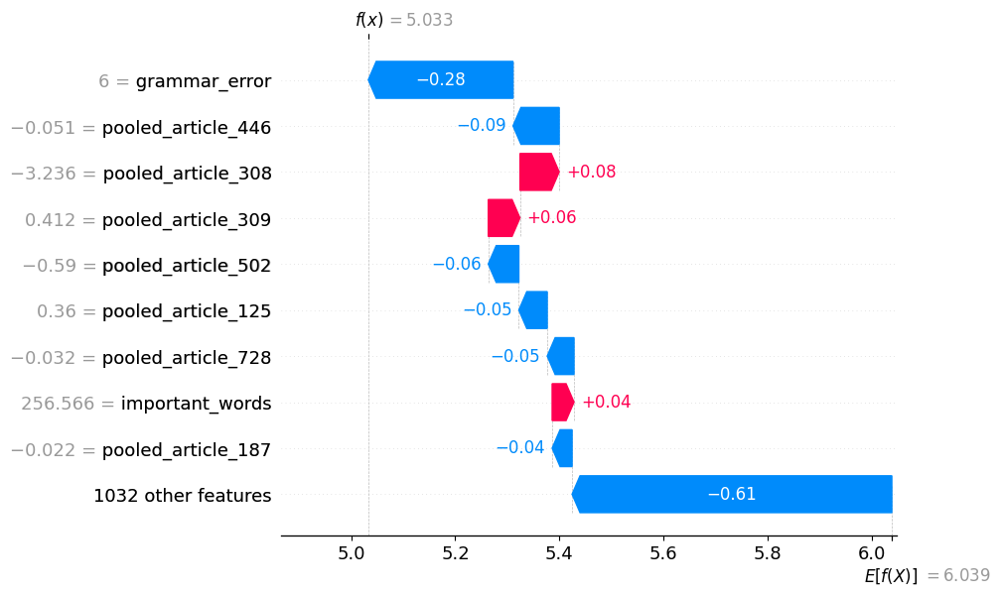
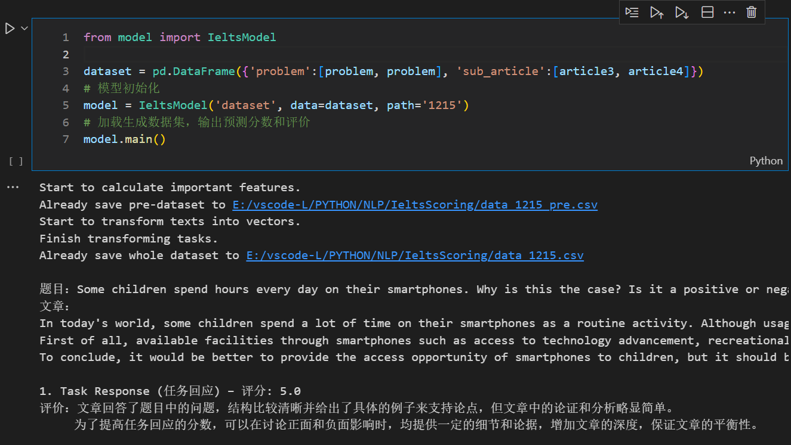
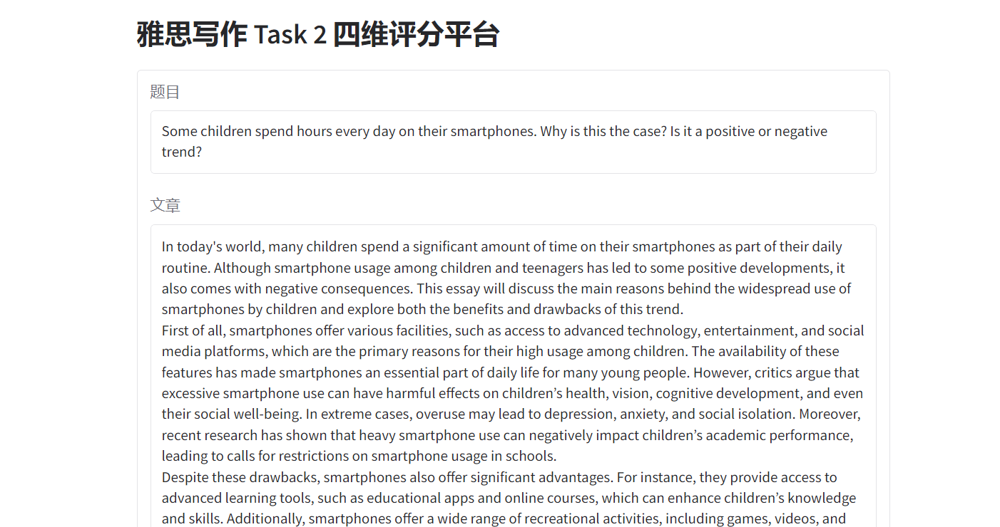
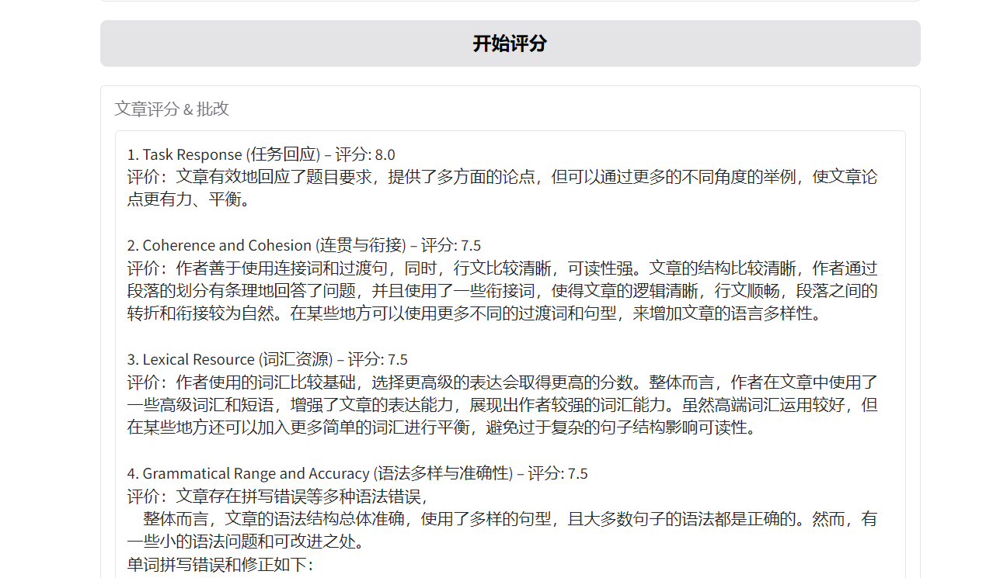

# 项目报告：基于BERT和DistilBART的雅思写作Task2多维评分系统

刘佳璇 2021201526

## 1. 研究背景与目标 

### 1.1 研究背景

雅思（IELTS）写作Task 2部分是评估考生英语写作能力的重要环节，分数直接关系到留学、移民等个人发展需求，其评分标准涉及任务响应（TR）、连贯与衔接（CC）、词汇资源（LR）和语法多样性与准确性（GA）四个维度。目前，现有的人工批改与在线AI批改服务存在一定的收费压力和准确性差异，尤其是在提高评分准确性和提供个性化批改等方面尚显不足。

因此，参考The AI Scientist论文中的自动化论文评审模型，基于预训练语言模型的雅思写作多维评分系统具备巨大的研究潜力，能够结合特征工程和Trusted ML，为考生提供更加准确精细和高效的评分服务。

### 1.2 研究目标

本研究的主要目标是开发一个基于BERT等预训练模型的雅思写作Task 2四维评分系统。具体来说，研究将着重从任务响应、连贯与衔接、词汇资源及语法多样性与准确性四个维度提升评分的准确性，生成评价和批改，分析影响各维度评分的关键因素，并验证这些维度的改进对整体评分的影响。

## 2. 数据准备

### 2.1 数据获取：[Engnovate (User Written IELTS Writing Task 2 Essays)](https://engnovate.com/ugc-ielts-writing-task-2-topics/)

- engnovate.com提供海量由认证雅思考官进行批改的、不同分数段Task2写作案例，包含四个维度的评分和批改；
- 爬取数据集包含3,963个题目、33,047篇文章，目标值为TR、CC、LR、GA四维分数和总评分；
- 爬虫程序脚本 [get_data.ipynb](./src/scripts/get_data.ipynb)；

### 2.2 数据预处理

- *drop_duplicates( df )*：删除爬取时存储的重复数据；
- *process_text( text )*：替换网页上使用的中文标点和换行符；
- *closest_score( score )*：将少量异常分数修改为最接近的规范值；

### 2.3 特征工程

#### 2.3.1 文本向量化（[bert.py](./src/scripts/bert.py)）

相较于TF-IDF、WordCount等向量化表示，BERT能够通过深度双向Transformer架构有效捕捉上下文信息，生成准确的语义表示，对于雅思写作评分问题，BERT能够理解文本的语言流畅性、语法结构和逻辑连贯性，从而提供有效评估。

考虑到BERT不适用于长文本分析，因此将文章分段落向量化并加权求和，得到模型的部分输入特征，示例代码如下。

``` python
def get_pooled_output(text):
    paragraphs = text.split('.\n')
    encoded_input = tokenizer(paragraphs, padding=True, truncation=True, return_tensors='pt', max_length=512)
    
    with torch.no_grad():
        outputs = model(**encoded_input)
    
    cls_embeddings = outputs.last_hidden_state[:, 0, :].numpy()
    pooled_output = np.mean(cls_embeddings, axis=0)
    return pooled_output
```

#### 2.3.2 文本分解与特征识别（[utils.py](./src/scripts/utils.py)）

为了从TR、CC、LR、GA四个维度获取更加准确的评分预测，从四个角度分解文章的句式、语法结构，生成可以量化的指标体系，共31个特征。

- 任务响应(TR)：

    * DistilBART生成文章摘要，计算BERT向量的余弦相似度；
    * 零样本分类（zero-shot-classification），结合题目、摘要生成prompt，获取评价分数和划分类别；

- 连贯与衔接(CC)：
    * 统计代词、过渡句的使用情况；
    * 引入指标Flesch Kincaid score, Gunning Fog score, SMOG score，衡量行文的流畅性和可读性；

- 词汇资源(LR):
    * 用独特词汇数/总词汇数（TTR）衡量词汇多样性；
    * 调用nltk.wordnet统计同义替换的使用次数；
    * 结合词向量分布和逆文档频率（IDF），提取33,047份样本中的稀有词汇，作为模型识别高级词汇的词汇库；

- 语法多样性与准确性(GA)：
    * 调用SpellChecker、language_tool_python等模块统计和纠正拼写错误、语法错误；
    * 通过正则化筛选大小写、时态、单复数使用错误；
    * 调用spacy模块按主语、谓语、从句、连词等结构拆分文章，统计简单句、长难句、情态动词、被动语态使用比例；

## 3. 模型选择

### 3.1 预训练语言模型

本项目根据每一个子任务的需求和类型，选择了不同的预训练模型。对于文本向量化，使用Transformer的encoder堆叠的BERT模型处理完整文本，有效捕捉上下文信息，生成准确的语义表示；对于摘要提取，使用专门为新闻等文本摘要提取任务优化的DistilBART-CNN-12-6；对于零样本分类，使用专门为自然语言推理（NLI）任务训练的bart-large-mnli，该模型能够理解句子对之间的逻辑关系，在没有额外监督数据的情况下进行多类分类任务。

```python
# 文本向量化
tokenizer = BertTokenizer.from_pretrained('bert-base-uncased')
model = BertModel.from_pretrained('bert-base-uncased')

# 摘要提取
tokenizer = AutoTokenizer.from_pretrained("sshleifer/distilbart-cnn-12-6")
model = AutoModelForSeq2SeqLM.from_pretrained("sshleifer/distilbart-cnn-12-6")

# 零样本分类
classifier = pipeline("zero-shot-classification", model="facebook/bart-large-mnli")
```

### 3.2 预测模型

参考自动化论文评审模型效果，在集成学习、深度学习、预训练模型等范围内尝试并着重对XGBoost的回归器和分类器、BERT模型进行调参，具体思路如下：

- 微调BERT模型，添加4维输出的全连接层
- 训练4个XGBoost回归模型，将输出分数调整至最接近的标准分数
- 训练4个XGBoost分类模型，将标准分数编码为0-19的类别变量

## 4. 模型训练与调参（[demo.ipynb](./src/scripts/demo.ipynb)）

### 实验环境

GPU：NVIDIA GeForce RTX 2080 Ti

### Finetune BERT

首先，尝试只依赖BERT生成的语义信息进行学习，具体而言，在微调BERT的基础上添加一层4维的全连接层，输出TR、CC、LR、GA四维分数，将其MSE的平均值作为目标学习，迭代20次后得到的最优模型MSE为1.98，考虑到BERT原本是为分类任务设计而非回归任务，因此不再进一步调试。

```python
class MyModel(nn.Module):
    def __init__(self):
        super(MyModel, self).__init__()
        self.device = "cuda:2" if torch.cuda.is_available() else "cpu"
        self.bert = BertModel.from_pretrained('bert-base-uncased') 
        # BERT模型微调
        for param in self.bert.parameters():
            param.requires_grad = True 
        # 全连接层，输出4维分数
        self.linear = nn.Linear(768, 4)

    def forward(self, x):
        input_ids, attention_mask = x[0].to(self.device), x[1].to(self.device)
        hidden_out = self.bert(input_ids, attention_mask=attention_mask, output_hidden_states=False)
        pred = self.linear(hidden_out.pooler_output)
        return pred
```

### XGBoost 回归

针对回归问题，经过多种机器学习、集成学习模型对比后选择了XGBoost，能够有效利用BERT生成的语义特征和2.3.2中构造的结构化特征，具备更强的鲁棒性和预测精度。

采用贝叶斯调优分别对4个XGBoost的学习率、样本训练比例、正则项、迭代次数等超参组合进行启发式寻优，取训练集(80%)的20%作为 Validation set 监测MSE作为调参目标。

```python
# 超参数搜索空间
pbounds = {
    'max_depth': (5, 10),
    'learning_rate': (0.02, 0.3),
    'n_estimators': (750, 1000),
    'subsample': (0.3, 1.0),
    'colsample_bytree': (0.3, 1.0),
    'reg_alpha': (0, 2),
    'reg_lambda': (0, 2)
}

optimizer = BayesianOptimization(
    f=xgb_evaluate,
    pbounds=pbounds,
    random_state=32
)
optimizer.maximize(init_points=10, n_iter=40)
```

考虑到回归任务的输出是一个连续值，需要通过函数ielts_score( prediction )用四舍五入的思想将分数调整为最接近的标准分数。

```python
def ielts_score(prediction):
    if prediction < 0:
        return 0.0
    elif prediction > 9:
        return 9.0
    else:
        return round(prediction * 2) / 2  # 四舍五入到最近的0.5分
```

### XGBoost 分类

作为对比，考虑到IELTS写作的标准化分数可以看作分类问题，尝试将四个维度分别进行encoding，转化为XGBoost可识别的类别变量。

使用softmax作为目标函数，训练和调参部分与回归任务一致。

```python
def encode_ielts_scores(name, scores):
    """将雅思成绩编码为整数类别"""
    if name == 'TR':
        return np.array((scores - 3) * 2, dtype=int)
    elif name == 'CC':
        return np.array((scores - 2.5) * 2, dtype=int)
    elif name == 'LR':
        return np.maximum((scores - 2.5) * 2, 0).astype(int)
    elif name == 'GA':
        return np.array((scores - 3) * 2, dtype=int)
    else: # score
        return np.array((scores - 4) * 2, dtype=int)
```

### 预测成果展示

本项目使用均方误差（MSE）评估模型效果。

| 模型 | TR | CC | LR | GA | score |
|:---:|:---:|:---:|:---:|:---:|:---:|
|XGB 回归|0.42|0.55|0.51|0.75|0.42|
|XGB 分类|0.55|0.75|0.65|1.05|0.54|
|Fin-BERT|-|-|-|-|1.98|

## 5. SHAP 模型解释

SHAP (SHapley Additive exPlanations) 能够提供对机器学习模型预测结果的透明度和可解释性，它为每个特征分配分别计算 Shapley 值，其计算考虑了在所有可能的特征组合中，特征对模型输出的边际贡献。



通过将训练好的模型和测试集输入shap中，能够得到所有特征对每个样本预测的贡献值，据此，我们可以在预测分数的基础上，针对每一篇作文生成批改和建议。以词汇资源（LR）模块为例，保留贡献绝对值足够大的特征，针对关键特征划分shap阈值，参考ChatGPT提供的模板形成评价。

```python
def lr_analysis(shap_values, score):
    keys = []
    for f, v in shap_values:
        if f == 'important_words' and v > 1e-2:
            keys.append('能够使用一些高级表达，对于文章评分属于加分项')
        elif f == 'important_words' and v < -5e-3:
            keys.append('使用的词汇比较基础，选择更高级的表达会取得更高的分数')
        elif f == 'repalce' and v > 0:
            keys.append('善于使用同义替换，使得文章的表达更丰富')
        elif f == 'repalce' and v < 0:
            keys.append('词汇使用存在同质化，可以尝试使用同义替换')
    if len(keys) > 0:
        text = '作者' + '；'.join(keys) + '。整体而言，' + lr_format[score_range(score)]
    else:
        text = '整体而言，' + lr_format[score_range(score)]
    return text
```

## 6. pipeline搭建和可视化

将数据预处理、特征工程、分数预测与评价脚本整合为pipeline，在脚本 [utils.py](./src/scripts/utils.py) 和 [model.py](./src/scripts/model.py) 中可见，生成的 IeltsModel 类由__init__, append_data, preprocess,  bert_process, predict_score, get_recommendations, results_to_csv, main函数构成，初始化类之后调用main函数即可获取评分和批改结果，并将数据集和评价文本存入指定文件。



基于gradio模块搭建可视化界面，在文本框中输入写作题目和文章，即可一键查询分数和批改评价，测试参考 [test.py](./src/scripts/test.py):





## 7. 总结与展望

### 工作总结
本项目基于BERT和DistilBART等预训练模型以及XGBoost，成功开发了一套雅思写作Task 2多维评分系统，旨在提升雅思写作批改的准确性和个性化服务。系统能够针对写作题目和文章生成任务响应（TR）、连贯与衔接（CC）、词汇资源（LR）和语法多样性与准确性（GA）四个维度的评分，结合特征工程和可信机器学习思想，提供全面且精细的分析和修正。

主要优势与亮点包括：

- **样本量丰富：** 项目从雅思官方认证网站Engnovate获取庞大数据集（3,963个题目和33,047篇文章），能够覆盖所有雅思写作题型和评分区间，确保了评分系统的广泛适用性。
- **高精度预测：** 在四个评估维度上，75% ~ 80%的测试样本的预测误差控制在0.5分以内。
- **子任务匹配：** 针对不同子任务使用最适合的预训练模型，充分利用BERT等模型的针对性训练目标。
- **可解释性强：** 基于特征工程构造的31个定制化特征和SHAP模型提供的特征贡献分析，系统可为每篇作文生成详细的个性化评价和建议。

### 未来展望

- 考虑Finetune-BERT模型经过微调后，池化层的向量输出是否能够更精准地描述雅思写作语境下的重要信息，替换初始向量化特征进行训练。
- 进一步开发特征工程，在各个子任务中尝试应用预训练模型的特定任务（如问答、零样本分类等），在不同维度挖掘更多重要特征。
- 相较于当前基于SHAP填充评价模板，尝试利用GPT的文本生成能力，实现自动批改和个性化作文润色功能，进一步提高作文质量。

---

## 附录：代码

### 代码链接

[GitHub 仓库地址](https://github.com/SevenLu0420/nlp24projects)

---
