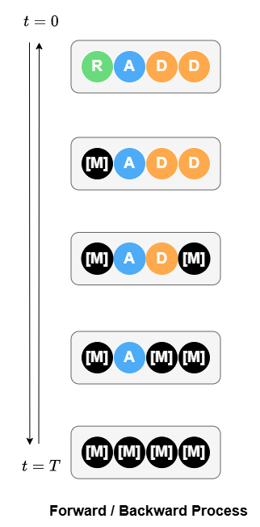

# 自然语言处理：课程作业报告 - 2021201746
##  主题:扩散语言模型


基于现有的扩散语言模型工作，我们提出了一个时间无关的重参数化吸收式离散扩散（RADD）。这类模型不需要加入时间条件，能够学习直接时间无关的条件概率。基于此视角，我们证明了吸收式离散扩散和任意顺序自回归模型的训练目标的统一性。此外，移除时间条件可以让我们用一种类似cache的策略来减少函数调用次数(NFEs)。

此代码库包含以下内容：

- 无时间条件的 RADD 架构实现
- 基于扩散模型和任意顺序自回归模型的采样代码
- 四种不同损失函数的训练代码
- zero-shot 结果评估代码
     


项目论文: [Your Absorbing Discrete Diffusion Secretly Models the Conditional Distributions of Clean Data](https://arxiv.org/abs/2406.03736)。


<details open>
<summary><font size="3">
左图: 吸收式离散扩散的加噪与去噪过程；右图: 时间无关的RADD网络结构
</font></summary>

<center>


</center>
</details>


## 代码组织

1. `run_train_ddp.py`: 用于训练的代码
2. `sampling.py`: 用于采样的代码
3. `noise_lib.py`: 噪声计划和正向扩散
4. `model/`: 模型架构
5. `losses.py`: 损失函数

## 实验环境

运行下面的命令安装所需的运行环境：

```bash
conda env create -f environment.yml
conda activate radd
```

## 预训练模型

我们基于不同损失函数训练了 400k 步的 RADD 模型，可在 Hugging Face 上获取：

| 模型                                                                   | 损失函数      |
| -------------------------------------------------------------------- | --------- |
| [radd-lambda-dce](https://huggingface.co/JingyangOu/radd-lambda-dce) | $\lambda$-DCE |
| [radd-t-dce](https://huggingface.co/JingyangOu/radd-t-dce)           | $t$-DCE |

例如，加载 `radd-t-dce` 模型和noise schdule：

```python
from load_model import load_model
model, noise = load_model('JingyangOu/radd-t-dce', device='cuda')
```

## 采样

在 `sampling.py` 中，我们提供了两个采样器：

- **DiffusionSampler**: 用于基于扩散模型的采样
- **OrderedSampler**: 用于任意顺序自回归模型采样

### 使用 `OrderedSampler` 采样

要执行任意顺序自回归模型采样，需首先定义生成顺序。例如，可使用以下代码按正向顺序 (0, 1, ..., args.length - 1) 生成文本：

```python
forward_order = torch.arange(0, args.length)
sampler = OrderedSampler(model, (args.batch_size, args.length), token_dim, args.strategy, args.strategy_para, forward_order, device=device)
samples = sampler.sample(args.steps)
```

此外，`OrderedSampler` 支持 `top_p` 和 `top_k` 采样策略，除了 `direct` 采样策略。以下脚本展示了使用 `top_p` 策略的示例：

```bash
python run_sample.py \
--model_path JingyangOu/radd-t-dce \
--batch_size 1 \
--length 1024 \
--steps 1024 \
--method ordered \
--strategy top_p \
--strategy_para 0.8
```

### 使用 `DiffusionSampler` 采样

**DiffusionSampler** 可选择 Tweedie $\tau$-leaping 方法或 Euler 方法。这两种方法均实现了缓存策略，采样速度较 D3PM 或 SEDD 提出的采样器相比提升最高达 3.5 倍。以下示例展示了使用 Tweedie  $\tau$-leaping 方法采样：

```bash
python run_sample.py \
--model_path JingyangOu/radd-t-dce \
--batch_size 1 \
--length 1024 \
--steps 1024 \
--method tweedie \
--strategy direct
```

### 条件采样

通过 `DiffusionSampler`，可使用 `prefix` 和 `suffix` 参数进行条件采样：

```bash
python run_sample_cond.py \
--model_path JingyangOu/radd-lambda-dce \
--batch_size 1 \
--length 1024 \
--steps 1024 \
--method tweedie \
--strategy direct \
--prefix "THIS IS PREFIX"  \
--suffix "THIS IS SUFFIX"
```

## 训练

我们提供了支持分布式数据并行（DDP）的训练代码，适用于单机多卡或或多机多卡运行：

```bash
# 单机多 GPU
torchrun --nnodes NNODES run_train_ddp.py

# 多机多 GPU
torchrun --nnodes NNODES --nproc_per_node NPROC_PER_NODE --master-addr MASTER_ADDR --node-rank NODE_RANK run_train_ddp.py
```

每次运行都会创建一个新的目录 `output/DATE/TIME`，结构如下：

```
├── output
│   ├── .hydra
│   │   ├── config.yaml
│   │   ├── ...
│   ├── checkpoints
│   │   ├── checkpoint_*.pth
│   ├── checkpoints-meta
│   │   ├── checkpoint.pth
│   ├── samples
│   │   ├── iter_*
│   │   │   ├── sample_*.txt
│   ├── wandb
│   │   ├── ...
│   ├── logs
```

其中，`checkpoints-meta` 用于在运行中断后重启训练，`samples` 包含运行过程中生成的样本，`logs` 包含运行输出。可通过 `ARG_NAME=ARG_VALUE` 添加参数，主要参数包括：

```
ngpus                     分配用于训练的 GPU 数量（使用 PyTorch DDP）
model                     可选值包括 small_radd, medium_radd
noise.type                可选值包括 geometric, loglinear
training.accum            梯度累积步数
training.loss_type        可选值包括 t_DSE, t_DCE, lambda_DCE, k_DCE
```

我们为 RADD 开发了四种不同的损失函数，详见 `losses.py`。可通过 `training.loss_type` 参数指定所需损失函数：

| 参数           | 损失函数         |
| ------------ | ------------ |
| `t_DSE`      | DSE 损失       |
| `t_DCE`      | $t$-DCE 损失 |
| `lambda_DCE` | $\lambda$-DCE 损失 |
| `k_DCE`      | 任意顺序自回归损失        |

例如，在一台配备 8 块 A100 80G GPU 的机器上使用 $t$-DCE  损失训练模型：

```bash
# 使用 t-DCE 损失训练模型
torchrun --nproc-per-node=8 train_ddp.py noise.type=loglinear model=small_radd ngpus=8 training.accum=1 training.loss_type=t_DCE
```

## 评估

为了评估训练模型的 zero-shot 结果，我们提供了评估脚本以计算模型在指定测试数据集上的困惑度（PPL）。以下是评估脚本的示例用法：

```bash
python evaluation_modeling.py \
--batch_size 16 \
--model_path JingyangOu/radd-lambda-dce \
--length 1024 \
--valid_dataset ptb \
--monte_carlo_timesteps 1024 \
--ngpus 4 \
--loss_type lambda_DCE \
--work_dir ./logs/radd-lambda-dce
```

评估结果（PPL）将输出到指定的 `work_dir` 中。】


