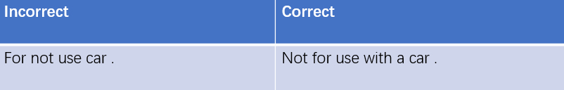
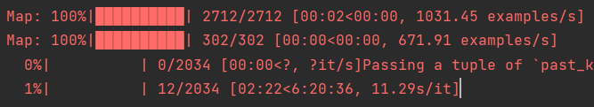
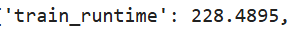
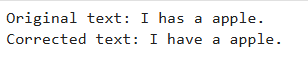

# 深度学习实现文本纠错
## 数据收集及处理
数据集采用的是经典的文本纠错数据集JFLEG
数据格式如下：



总共包含3000多条数据。
数据预处理代码如下：
```python
# 定义数据预处理函数
def preprocess_function(examples):
    # 为T5模型生成 "correct: " 的前缀
    inputs = ["correct: " + (text if text is not None else "") for text in examples['incorrect_text']]
    model_inputs = tokenizer(inputs, max_length=512, truncation=True, padding="max_length")
    
    # 为目标文本生成token id
    outputs = [(text if text is not None else "") for text in examples['correct_text']]
    with tokenizer.as_target_tokenizer():
        labels = tokenizer(outputs, max_length=512, truncation=True, padding="max_length")

    model_inputs['labels'] = labels['input_ids']
    return model_inputs
 ```
数据处理代码如下：
```python
# 将数据分为训练集和验证集
train_data, eval_data = train_test_split(data, test_size=0.1, random_state=42)

# 将数据转为 Hugging Face Dataset 格式
train_dataset = Dataset.from_pandas(train_data)
eval_dataset = Dataset.from_pandas(eval_data)
```

## 模型选择
文本纠错任务需要模型能够准确识别和纠正拼写、语法和上下文错误，确保生成的文本在语法和语义上都正确。同时，纠错模型需要理解句子的上下文，以便在纠正错误时考虑到整体语义，避免产生新的错误。在此基础上，生成的纠正文本应当自然流畅，符合人类的语言使用习惯，不能只是简单的拼写或语法修正，而是要提升文本的可读性。纠错模型还需要能够处理多种类型的错误，包括拼写错误、语法错误、标点错误以及上下文不当等，适应不同的文本风格和领域。
综合以上因素，选择t5系列模型来完成任务。
T5将所有任务视为文本到文本的转换，这种设计使得文本纠错任务可以简单地输入错误文本并输出纠正文本，简化了任务处理。同时，T5在大规模文本数据上进行预训练，具备丰富的语言知识和上下文理解能力，能够有效识别和纠正多种语言错误。上下文理解上，T5能够利用上下文信息来判断文本中的错误，能够理解句子结构和语义，使得纠正结果更加准确和合理。在语言生成上，T5不仅能识别错误，还能生成自然流畅的修正文本，确保结果符合语言习惯，提高用户体验。并且T5模型可以通过少量的标注数据进行微调，适应特定领域或风格的文本纠错任务，具有很好的适应性。
最后T5在多个自然语言处理基准上表现优异，证明了其在文本生成和理解方面的强大能力，适合处理复杂的文本纠错任务。
考虑到硬件条件的不足，所以最终采用t5-small模型来完成该任务。

## 模型训练
首先设置模型的一系列相关参数并且根据这些参数以及我们之前处理好的数据集创建一个对象
```python
# 设置训练参数
training_args = TrainingArguments(
    output_dir='./results',              # 输出目录
    learning_rate=2e-5,                  # 学习率
    per_device_train_batch_size=4,       # 每设备训练batch大小
    per_device_eval_batch_size=8,        # 每设备评估batch大小
    num_train_epochs=3,                  # 训练周期数
    weight_decay=0.01,                   # 权重衰减
    logging_dir='./logs',                # 日志目录
    save_steps=5000,                     # 每多少步保存模型
    logging_steps=500,                   # 每多少步记录日志
    do_train=True,                       # 是否训练
    do_eval=True,                        # 是否评估
)

# 创建Trainer对象
trainer = Trainer(
    model=model,                         # 使用的模型
    args=training_args,                  # 训练参数
    train_dataset=train_dataset,         # 训练数据集
    eval_dataset=eval_dataset,           # 验证数据集
)
```
再调用
```python
trainer.train()
```
进行模型的训练和微调。
在训练时发现，本地跑一次的训练时间代价过于昂贵，需要多个小时，对于这个项目大小来说，这个时间代价是不可接受的，



所以到openi平台上租借了一个带有GPU A100的服务器，对部分代码进行微调过后，使用GPU再次训练，训练时间下降到了3min左右。




## 结果
成功实现了简单文本错误的纠正




